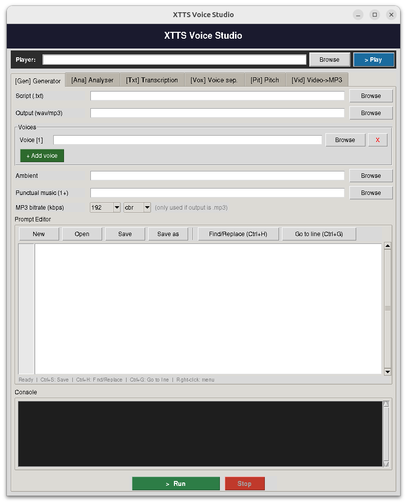

# XTTS Voice Studio

A complete toolkit for voice cloning, guided meditation generation, song transcription, and audio processing — built around Coqui XTTS v2 with a Tkinter GUI that unifies every script under one roof.

  

---

## Overview

XTTS Voice Studio is a personal production suite for:

- **Cloning voices** from short audio samples (via XTTS v2)
- **Generating guided meditations** with multi-voice narration, ambient music, punctual sound cues, and per-voice fine-tuning
- **Transcribing songs or speech** into XTTS-compatible scripts with pause detection and optional pitch annotation
- **Separating voices** by F0, removing background music (demucs), and cleaning audio (dereverberation)
- **Applying pitch correction** to cloned voices
- **Converting video files** to audio in multiple formats

The suite runs natively on Linux and under WSL (Windows Subsystem for Linux) with Ubuntu. Audio playback in the GUI player is not available under WSL due to audio stack limitations, but all generation and processing features work normally.

Every tool is accessible through a single Tkinter interface (`xtts_studio.py`) or directly from the command line.



---

## Features at a glance

| Tab | Script | Purpose |
|-----|--------|---------|
| **[Gen] Generator** | `guided_meditation_generator_v23.py` | Multi-voice guided meditations — XTTS v2, ambient music, parallel overlay, reverb, noise gate, pan, limiter — output to WAV / MP3 / FLAC / OGG |
| **[Ana] Analyser** | `voice_analyser.py` | Analyse a voice WAV and produce ready-to-paste `{}` and `[]` parameter blocks |
| **[Txt] Transcription** | `transcribeSong2txt_with_pause.py` or `video2txt.py` | Whisper transcription with pause markers and optional per-word pitch annotation |
| **[Vox] Voice sep.** | `extract_voices.py` | Separate voices by F0, remove background music (demucs), dereverberate, replace silences — output to WAV / MP3 / FLAC / OGG |
| **[Pit] Pitch** | `apply_pitch_to_clone.py` | Apply pitch correction to a cloned voice file |
| **[Vid] Video->Audio** | `ffmpeg` | Extract audio from any video — output to MP3 / WAV / FLAC / OGG |

---

## Installation

### Requirements

- Python 3.10
- Miniconda or Anaconda
- CUDA 12.x + GPU (optional but recommended)
- `ffmpeg` with `libmp3lame`

### Steps

```bash
# 1. Clone
git clone https://github.com/ZFEbHVUE/XTTS-Voice-Studio.git
cd XTTS-Voice-Studio

# 2. Create environment
conda create -n xtts python=3.10
conda activate xtts

# 3. Core dependencies
pip install TTS torch torchaudio
pip install faster-whisper
pip install librosa pydub numpy soundfile
pip install pyrubberband

# 4. Voice separation backends (optional)
pip install demucs             # music removal
pip install noisereduce        # fast dereverberation (CPU)
pip install nara-wpe           # precise reverb removal (CPU)
pip install deepfilternet      # best quality dereverberation (GPU supported)

# 5. System packages (Ubuntu/Debian)
sudo apt install ffmpeg rubberband-cli

# 6. Verify CUDA (optional)
python -c "from faster_whisper import WhisperModel; m = WhisperModel('tiny', device='cuda', compute_type='float16'); print('CUDA OK')"
```

---

## Directory structure

```
XTTS-Voice-Studio/
├── Python_Scripting/
│   ├── xtts_studio.py                      # Tkinter GUI (main entry point)
│   ├── guided_meditation_generator_v23.py
│   ├── voice_analyser.py
│   ├── extract_voices.py
│   ├── transcribeSong2txt_with_pause.py
│   ├── video2txt.py
│   └── apply_pitch_to_clone.py
├── Prompts/                    # Text scripts for meditation generation
├── Voices_Cloning/             # Voice samples for XTTS cloning (.wav, 6–60s)
├── Ambient_Musics/             # Background ambient loops
├── Punctual_sounds/            # One-shot audio cues (bells, chimes)
├── MP3toTXT/                   # Audio/video sources for transcription
├── Output_Song_files/          # Generated meditation files
├── Song_to_TXT_with_Pauses/    # Transcribed text files
└── README.md
```

---

## Usage

### Launching the GUI

```bash
conda activate xtts
python ~/XTTS-Voice-Studio/Python_Scripting/xtts_studio.py
```

---

## Guided Meditation Generator

### Script syntax

```
# XTTS params (14 values — positions 12–14 can be omitted for v20/v21 compatibility)
{N, seed, trim_start, trim_end, fade_in, fade_out, temp, top_k, top_p, rep_pen, len_pen, gpt_cond_len, gpt_cond_chunk_len, sound_norm_refs}

# Audio params (16 values — positions 13–16 can be omitted)
[N, LANG, speed, vol, eq_low, eq_mid, eq_high, hp, lp, NR, comp, de-ess, reverb, noise_gate, pan, limiter]
```

**XTTS block `{}` — positions 12–14 (v23):**

| Position | Parameter | Default | Notes |
|----------|-----------|---------|-------|
| 12 | `gpt_cond_len` | 30 | Seconds of reference WAV used for cloning. Set to actual WAV duration, max 60. Higher = better fidelity. |
| 13 | `gpt_cond_chunk_len` | 4 | GPT conditioning chunk size. Rarely needs changing. |
| 14 | `sound_norm_refs` | 0 | Normalise reference WAV before cloning (0=off, 1=on). |

**Audio block `[]` — positions 13–16 (v23):**

| Position | Parameter | Default | Notes |
|----------|-----------|---------|-------|
| 13 | `reverb` | 0 | Wet level 0–1 via ffmpeg `aecho`. Adds spatial presence. |
| 14 | `noise_gate` | 0 | Threshold dB via ffmpeg `agate` (e.g. -40). Removes breath noise between words. |
| 15 | `pan` | 0 | Stereo pan: -1.0=left, 0=centre, +1.0=right. |
| 16 | `limiter` | 0 | Output limiter (0=off, 1=on). Prevents clipping. |

**Value 0 = keep default** for all parameters where 0 is invalid (temperature, top_k, top_p, rep_pen, len_pen, gpt_cond_len, gpt_cond_chunk_len).

### Example script

```
ambient_volume=-18
music_1=5s,-10

{1, 42, 110, 255, 150, 300, 0.65, 50, 0.85, 5.0, 1.0, 40, 4, 0}
[1, FR, 0.85, +1, -5, +1, -1, 90, 9000, 0.3, 0.4, 0.2, 0, 0, 0, 1]
Welcome to this guided meditation session.
[pause=3s]
Take a deep breath in through your nose.
[pause=5s,start]
[music=1]
And slowly exhale through your mouth.
```

### Parallel voice overlay

Two or more voices speaking simultaneously, each with independent text and parameters:

```
# All voices start at the same time
[parallel]
{1, ...} [1, FR, 0.85, +1, ..., -0.3, 1]  The main narrator speaks.
{2, ...} [2, FR, 0.90, -6, ..., +0.3, 1]  A second voice whispers underneath.
[/parallel]

# Staggered entry: voice 2 at 1s, voice 3 at 5s
[parallel, offset=1s,5s]
{1, ...} [1, FR, ...] First voice begins immediately.
{2, ...} [2, FR, ...] Second voice enters after 1 second.
{3, ...} [3, FR, ...] Third voice joins at 5 seconds.
[/parallel]
```

- `offset=` values are **absolute start times** for voices 2, 3, 4, ... — voice 1 always starts at 0s
- The block can be written on a single line or across multiple lines
- No limit on the number of simultaneous voices

### Pause syntax

```
[pause=2s]           # fixed 2s silence
[pause=4s,start]     # total (speech + silence) = 4s
```

### Output formats

Format is auto-detected from the output file extension: `.wav`, `.mp3`, `.flac`, `.ogg`

```bash
python guided_meditation_generator_v23.py prompt.txt output.mp3 voice.wav \
    --mp3-bitrate 256 --mp3-mode cbr
```

### Command line

```bash
python guided_meditation_generator_v23.py \
    ~/XTTS-Voice-Studio/Prompts/prompt.txt \
    ~/XTTS-Voice-Studio/Output_Song_files/output.wav \
    ~/XTTS-Voice-Studio/Voices_Cloning/voice1.wav \
    ~/XTTS-Voice-Studio/Voices_Cloning/voice2.wav \
    ~/XTTS-Voice-Studio/Ambient_Musics/forest.wav \
    ~/XTTS-Voice-Studio/Punctual_sounds/bell.wav
```

---

## Voice Separation (`extract_voices.py`)

### Modes

**1. Music removal (demucs)** — strips background music and noise, outputs a clean vocal stem with no F0 filtering and no cuts:

```bash
python extract_voices.py input.mp3 output.mp3 --remove-music --demucs-model htdemucs_ft
```

**2. Voice separation by F0** — classifies segments as female, male, or overlap, keeps the requested category, and replaces discarded segments with silence:

```bash
python extract_voices.py input.wav output.wav \
    --keep female --silence 1.0 --threshold 165 --overlap-range 200
```

**3. Dereverberation only** — clean a file without any F0 filtering:

```bash
python extract_voices.py vocals.wav clean.wav \
    --keep "vocals only" --dereverberate deepfilter
```

**4. Silence replacement in a single-voice file** — replace natural pauses with a fixed duration. Set `--min-silence` to match the natural pause length in the recording:

```bash
python extract_voices.py voice.wav output.wav \
    --keep female --silence 1.0 --min-silence 0.30
```

### Parameters

| Parameter | Default | Description |
|-----------|---------|-------------|
| `--keep` | `female` | `female`, `male`, `overlap`, `all`, `female,male`, `vocals only` |
| `--silence` | `auto` | Gap between kept segments: `auto`=natural, `0`=none, `N`=fixed N seconds |
| `--min-silence` | 0.15 | Minimum pause (s) to split segments. Use 0.3–0.5 for sentence-level splitting in single-voice files |
| `--threshold` | 165 | F0 boundary male/female in Hz |
| `--overlap-range` | 200 | F0 range above which a segment is classified as overlap. Use 200+ for solo voice files |
| `--remove-music` | off | Run demucs to strip background music before processing |
| `--demucs-model` | `htdemucs_ft` | `htdemucs` (fast), `htdemucs_ft` (best vocals), `mdx_extra` (dense music) |
| `--dereverberate` | `none` | `noisereduce` (CPU), `wpe` (CPU), `deepfilter` (GPU supported) |
| `--mp3-bitrate` | 192 | 128 / 160 / 192 / 256 / 320 kbps — only when output is `.mp3` |
| `--mp3-mode` | `cbr` | `cbr` (constant) or `vbr` (variable) |
| `--debug` | off | Print per-segment classification detail |

**GPU**: auto-detected at startup. Demucs and DeepFilterNet use CUDA when available; noisereduce and WPE are CPU-only.

---

## Song Transcription

Powered by `faster-whisper` (2–4× faster than openai-whisper at identical quality).

```bash
# Recommended for GTX 1650 (optiplex)
python transcribeSong2txt_with_pause.py audio.mp3 output.txt small 0.3 fr --pitch --device cuda --vad

# Recommended for RTX A4500 (asteria) — best quality
python transcribeSong2txt_with_pause.py audio.mp3 output.txt large-v3 0.1 fr --pitch --device cuda --vad
```

**Model selection by GPU:**

| GPU VRAM | Recommended model |
|----------|-------------------|
| ~4 GB (GTX 1650) | `small` |
| ~8 GB | `medium` or `turbo` |
| 20 GB+ (RTX A4500) | `large-v3` |

**Features:**
- Word-level timestamps for precise pause detection
- Optional per-word pitch annotation (`[p:+2]`, `[p:-1]`, `[p:?]` for unvoiced)
- Silero VAD pre-filter via `--vad`
- Automatic CUDA → CPU fallback
- Output is drop-in compatible with the Guided Meditation Generator

---

## Voice Analyser

Analyses a reference WAV and outputs ready-to-paste `{}` and `[]` blocks for `guided_meditation_generator_v23.py`. Derives all 14 XTTS params and all 16 audio params from acoustic analysis.

```bash
python voice_analyser.py --precise --start-num 1 voice.wav FR
```

**Derived parameters include:**
- `gpt_cond_len` — set to actual WAV duration (capped at 60s) for best cloning fidelity
- `repetition_penalty` — derived from F0 jitter (expressive → 4.0, monotone → 6.0–7.0)
- `length_penalty` — derived from voiced_ratio (fast speaker → 0.9, slow/breathy → 1.1)
- `noise_gate` — auto-suggested from SNR
- Adaptive fades derived from voice dynamics
- Breathiness detection via spectral flatness — adjusts NR and compression automatically

---

## Troubleshooting

**`faster-whisper` not installed**
```bash
pip install faster-whisper
```

**`demucs` not installed**
```bash
pip install demucs
```

**`deepfilternet` not installed**
```bash
pip install deepfilternet
```

**CUDA errors about missing `cudnn_ops_infer.so`**
```bash
pip install nvidia-cudnn-cu12 nvidia-cublas-cu12
```

**`scipy` UnicodeDecodeError with `mdx_extra` demucs model**
```bash
pip install --upgrade scipy
# or prefix command with: LC_ALL=C python ...
```

**MP3 output fails**
```bash
ffmpeg -codecs | grep mp3lame   # verify libmp3lame is available
```

**`0 segments detected` in voice separation**
The RMS threshold adapts automatically. If noisereduce produced NaN values on an already-clean file, re-run without `--dereverberate` or use `--keep all`. For single-voice files where silences are not detected, increase `--min-silence` to 0.3–0.5.

**Audio player silent under WSL**
`ffplay` has no direct access to the Windows audio stack under WSL. Open the generated file directly in Windows Explorer instead.

**XTTS asks for terms of service on first run**
Answer `y` at the prompt, or pre-accept by editing `~/.local/share/tts/`.

---

## Credits

- **XTTS v2** by [Coqui](https://github.com/coqui-ai/TTS)
- **faster-whisper** by [SYSTRAN](https://github.com/SYSTRAN/faster-whisper)
- **librosa** for F0 analysis
- **pydub** and **Rubberband** for audio processing
- **demucs** by [Facebook Research](https://github.com/facebookresearch/demucs)
- **DeepFilterNet** by [Hendrik Schröter](https://github.com/Rikorose/DeepFilterNet)
- Guided meditation concept and multi-voice orchestration: personal project

---

## License

MIT — see [LICENSE](LICENSE) for details.

---

## Author

[ZFEbHVUE](https://github.com/ZFEbHVUE) — GitHub

> The username `ZFEbHVUE` reads as `STEPHANE` when mirrored vertically.
