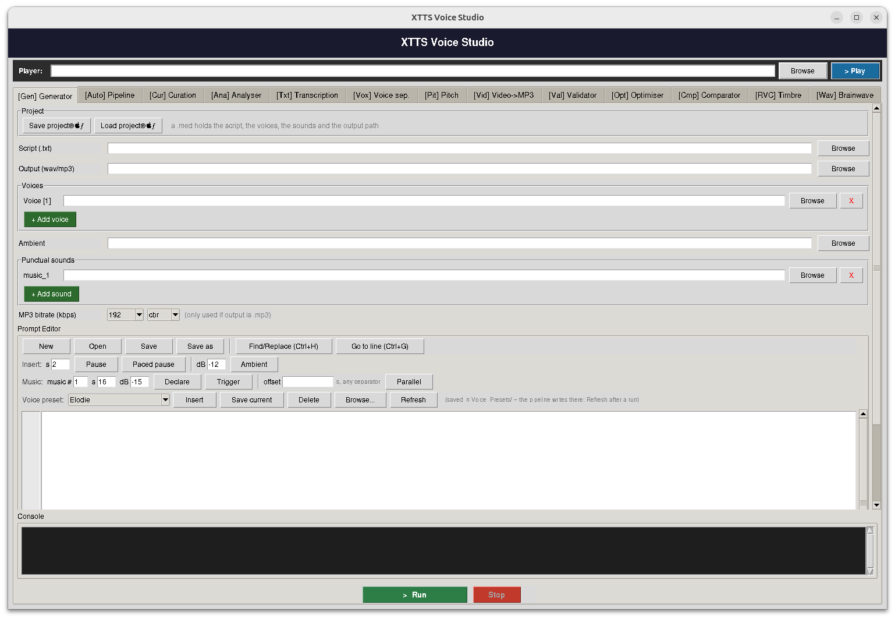

# XTTS Voice Studio

A complete toolkit for voice cloning, guided meditation generation, audio analysis, parameter validation and automated optimisation — built around Coqui XTTS v2 with a unified Tkinter GUI.

  

---

## Overview

XTTS Voice Studio is a personal production suite for:

- **Cloning voices** from short audio samples via XTTS v2
- **Generating guided meditations** with multi-voice narration, ambient music and punctual sound cues
- **Analysing voices** acoustically (Praat + librosa) to derive optimal XTTS parameters automatically
- **Validating parameters** empirically by generating and comparing audio variations
- **Comparing clones** to their reference voice spectrally and optimising audio parameters automatically via iterative feedback
- **Transcribing** audio and video to XTTS-ready scripts
- **Separating voices** by gender from mixed audio sources
- **Converting video** to audio in various formats

Every tool is accessible through a single Tkinter interface (`xtts_studio.py`) or directly from the command line.



---

## Installation

### Requirements

- Python 3.10+
- Miniconda or Anaconda (recommended)
- CUDA 12.x + compatible GPU (optional but significantly faster)
- `ffmpeg` and `rubberband-cli` (system packages)

### Step 1 — Clone the repository

```bash
cd ~
git clone https://github.com/ZFEbHVUE/XTTS-Voice-Studio.git
cd XTTS-Voice-Studio
```

### Step 2 — Create the conda environment

```bash
conda create -n xtts python=3.10
conda activate xtts
```

### Step 3 — Install dependencies

```bash
pip install TTS torch torchaudio --index-url https://download.pytorch.org/whl/cu121
pip install faster-whisper librosa pydub numpy soundfile pyrubberband scipy
pip install torchcrepe demucs noisereduce nara-wpe deepfilternet
pip install praat-parselmouth

sudo apt install ffmpeg rubberboard-cli
```

### Step 4 — Launch the GUI

```bash
conda activate xtts
python ~/XTTS-Voice-Studio/Python_Scripting/xtts_studio.py
```

`XTTS_ROOT` is auto-detected from the script location — no hardcoded paths. You can rename or move the directory freely.

---

## Directory Structure

```
XTTS-Voice-Studio/
├── Python_Scripting/
│   ├── xtts_studio.py                      # Tkinter GUI (main entry point)
│   ├── guided_meditation_generator_v23.py  # Meditation generator
│   ├── voice_analyser.py                   # Acoustic analysis → XTTS params
│   ├── voice_validator.py                  # Empirical parameter validation
│   ├── voice_comparator.py                 # Spectral comparison & auto-optimisation
│   ├── extract_voices.py                   # Vocal separation by gender
│   ├── transcribeSong2txt_with_pause.py    # Audio transcription
│   └── video2txt.py                        # Video transcription
├── Prompts/                                # Text scripts for meditation generation
├── Voices_Cloning/                         # Voice reference samples (.wav)
├── Ambient_Musics/                         # Background ambient loops
├── Punctual_sounds/                        # One-shot audio cues (bells, chimes)
├── MP3toTXT/                               # Audio/video sources for transcription
├── Output_Song_files/                      # Generated meditation WAVs
└── README.md
```

---

## GUI Tabs

### [Gen] Generator

Generates guided meditation audio from a text script with pause markers and voice blocks.

- Per-voice rows with multi-reference browse (space-separated WAV files)
- `+ Add voice` button
- Ambient music and punctual sound cue inputs
- MP3/FLAC/OGG output options

### [Ana] Analyser

Analyses voice reference files and produces ready-to-paste XTTS parameter blocks.

- Per-voice rows with multi-file browse (multiple files averaged per voice)
- Per-voice **Praat / Librosa** selector — Praat gives more accurate results
- Per-voice F0 engine selector: `none` (fast YIN) / `auto` / `crepe` / `pyin` (only in Prec mode)
- FINAL SUMMARY with all voices in ready-to-paste format including analysis options

### [Txt] Transcription

Transcribes audio or video files to XTTS-ready text with pause markers.

### [Vox] Voice sep.

Separates vocal stems from mixed audio or video sources.

- Accepts audio (WAV, MP3, FLAC) and video (MP4, MKV, AVI, MOV, WEBM...)
- F0-based male/female separation
- demucs music removal (htdemucs, htdemucs_ft, mdx_extra)
- Dereverberation: none / noisereduce / wpe / deepfilter

### [Pit] Pitch

Applies pitch correction to cloned voice audio.

### [Vid] Video→Audio

Extracts audio from any video file with format, channel and sample rate options. Includes an **XTTS preset** button (WAV + mono + 22050 Hz).

### [Val] Validator

Empirically validates XTTS parameters by generating multiple variations and combining them into a single audio file for A/B listening.

- Multi-parameter rows with dynamic combobox filtering (used params excluded from other rows)
- Cartesian product of all parameter combinations
- Auto-fill Values field from XTTS/Audio blocks when selecting a parameter
- **Default** / **Raw** fill buttons
- Single XTTS generation for audio params (fast), N generations for XTTS params

### [Cmp] Comparator

Compares a reference voice spectrally with a generated clone and automatically optimises the `[]` audio parameters via iterative feedback.

- Reference voice used for both spectral comparison AND XTTS cloning
- Configurable number of iterations (default 1) with convergence threshold
- Optimises: `vol`, `eq_low`, `eq_mid`, `eq_high`, `hp`, `lp`, `comp` automatically
- `[]` Audio params field updates in real-time after each iteration
- Generates both a base clone and a final optimised clone

---

## Guided Meditation Generator

### XTTS parameter block `{}` — 14 values

```
{N, seed, trim_start, trim_end, fade_in, fade_out, temp, top_k, top_p, rep_pen, len_pen, gpt_cond_len, gpt_cond_chunk_len, sound_norm_refs}
```

| Pos | Parameter | Default | Description |
|-----|-----------|---------|-------------|
| 1 | `N` | — | Voice number |
| 2 | `seed` | 0 | Random seed (0 = random). **Test several seeds per voice — the seed interacts with the embedding in an unpredictable way.** |
| 3 | `trim_start` | 0 | Trim from start (ms) |
| 4 | `trim_end` | 0 | Trim from end (ms) |
| 5 | `fade_in` | 100 | Fade-in (ms) |
| 6 | `fade_out` | 250 | Fade-out (ms) |
| 7 | `temperature` | 0.65 | GPT sampling temperature |
| 8 | `top_k` | 50 | GPT top-k |
| 9 | `top_p` | 0.85 | GPT top-p |
| 10 | `rep_pen` | 5.0 | Repetition penalty |
| 11 | `len_pen` | 1.0 | Length penalty |
| 12 | `gpt_cond_len` | 30 | Reference WAV seconds used for cloning (up to 60) |
| 13 | `gpt_cond_chunk_len` | 4 | GPT conditioning chunk size |
| 14 | `sound_norm_refs` | 0 | Normalise reference before cloning (0/1) |

### Audio parameter block `[]` — 16 values

```
[N, LANG, speed, vol, eq_low, eq_mid, eq_high, hp, lp, NR, comp, de-ess, reverb, noise_gate, pan, limiter]
```

| Pos | Parameter | Default | Description |
|-----|-----------|---------|-------------|
| 1 | `N` | — | Voice number |
| 2 | `LANG` | FR | Language code |
| 3 | `speed` | 1.0 | Rubberband speed factor (0.5–2.0) |
| 4 | `vol` | 0 | Volume adjustment (dB) |
| 5 | `eq_low` | 0 | Low EQ 80–300 Hz (dB) |
| 6 | `eq_mid` | 0 | Mid EQ 300–3000 Hz (dB) |
| 7 | `eq_high` | 0 | High EQ 3000–8000 Hz (dB) |
| 8 | `hp` | 0 | Highpass filter (Hz, 0=off) |
| 9 | `lp` | 0 | Lowpass filter (Hz, 0=off) |
| 10 | `NR` | 0 | Noise reduction (0=off) |
| 11 | `comp` | 0 | Compression (0=off) |
| 12 | `de-ess` | 0 | De-esser (0=off) |
| 13 | `reverb` | 0 | Reverb wet level (0=off) |
| 14 | `noise_gate` | 0 | Noise gate threshold dB (0=off) |
| 15 | `pan` | 0 | Stereo pan (-1.0=left, 0=centre, +1.0=right) |
| 16 | `limiter` | 0 | Output limiter (0=off, 1=on) |

### Per-voice config persistence

Short blocks inherit the last full config for that voice:

```
{1, 42, 0, 420, 100, 250, 0.68, 50, 0.85, 5, 1.05, 60, 4, 0}
[1, FR, 0.9, 5, -3, 0, -4, 95, 8500, 0.35, 0.35, 0.5, 0, 0, 0, 1]
Première phrase.
[pause=2s]

[1, FR, 0.8]
Deuxième phrase plus lente.
[pause=2s]
```

### Multi-reference voices

Multiple reference files per voice significantly improve cloning quality — XTTS averages the speaker embeddings:

```bash
generator.py script.txt output.wav ref1.wav ref2.wav ref3.wav -- hollie.wav
```

### Parallel voice overlay

```
[parallel, offset=1s,5s]
{1, 42, ...} [1, FR, ...] First voice starts immediately.
{2, 0, ...}  [2, FR, ...] Second voice enters at 1s.
{3, 0, ...}  [3, FR, ...] Third voice enters at 5s.
[/parallel]
```

---

## Voice Analyser

Analyses one or more reference files and produces ready-to-paste parameter blocks.

### Analysis modes

| Mode | Engine | Speed | Accuracy |
|------|--------|-------|----------|
| Fast (default) | YIN + Librosa | ~8s | Good |
| Fast + Praat | YIN + Praat | ~8s | **Better** |
| Precise + Praat | pyin/crepe + Praat | 30–90s | Best for atypical voices |

**Conclusion from testing:** Praat vs Librosa is the meaningful choice — the F0 engine (none/pyin/crepe) has negligible impact on typical voices. Praat gives more accurate `NR`, `comp`, `hp` and `temp` via HNR, APQ5 and formant analysis.

### Multi-reference averaging

Multiple files per voice are averaged into a single block — more reference material = better cloning:

```bash
voice_analyser.py --precise ref1.wav ref2.wav ref3.wav FR
```

### Analysis output

```
# Voice 1 [FR]  soprano / high voice  214 Hz
# Analysis: Praat + pyin | seed=42
{1, 42, 0, 200, 100, 250, 0.72, 55, 0.88, 4.5, 1, 60, 4, 0}
[1, FR, 0.9, 6, -2, 1, -4, 95, 8000, 0.35, 0.35, 0.5, 0, 0, 0, 1]
```

---

## Validator

Generates multiple audio variations with different parameter values, concatenates them with spoken labels, and lets you listen and choose.

### Workflow

1. Paste `{}` and `[]` blocks from voice_analyser (or use Default/Raw fill)
2. Select a parameter — Values field auto-fills with the current value
3. Edit values around the current value to test
4. Add more parameters with `+ Add parameter` — cartesian product is generated
5. Listen to the output WAV — each variation is preceded by a spoken label

### Parameter types

- **Audio params** (`hp`, `lp`, `eq_*`, `NR`, `comp`...) → single XTTS generation + N filter applications (fast)
- **XTTS params** (`seed`, `temp`, `rep_pen`...) → N separate XTTS generations (slower)

### Important note on seed

The seed interacts with the voice embedding unpredictably. A seed that works perfectly for one reference may produce accent degradation with another. Always test several seeds (0, 7, 13, 42, 100, 200) for each voice. Use seed=0 for random generation.

---

## Comparator

Compares a reference voice spectrally with a generated clone and automatically optimises the `[]` audio parameters via iterative feedback.

### How it works

1. Generates a clone with the provided `{}` and `[]` blocks
2. Analyses both files spectrally (RMS, crest factor, centroid, EQ bands)
3. Computes corrections for `vol`, `eq_low`, `eq_mid`, `eq_high`, `hp`, `lp`, `comp`
4. Updates `[]` and generates a new clone
5. Repeats until convergence (score improvement < threshold or params unchanged)
6. Saves the final optimised clone

### What is optimised automatically

| Parameter | Criterion | Optimised |
|-----------|-----------|-----------|
| `vol` | RMS gap | ✅ |
| `eq_low` | Low-band % gap | ✅ |
| `eq_mid` | Mid-band % gap | ✅ |
| `eq_high` | Spectral centroid gap | ✅ |
| `hp` | Excess bass in clone | ✅ |
| `lp` | Excess/lacking highs | ✅ |
| `comp` | Crest factor gap | ✅ |
| `speed` | ❌ texts differ | — |
| `NR`, `de-ess`, `reverb` | ❌ not measurable | — |

### Important note

Use a **short test text** (3–5 sentences) for fast iterations — the comparator compares spectral characteristics, not duration. The `{}` XTTS params are not modified by the comparator; use the Validator for those.

---

## Recommended Workflow

1. **Extract reference audio** → Video→Audio tab with XTTS preset (WAV, mono, 22050 Hz)
2. **Clean if needed** → Vox tab with demucs + deepfilter
3. **Analyse** → Analyser tab, Praat mode, multiple reference files
4. **Validate seed** → Validator tab, test `seed` with values `0 7 13 42 100 200`
5. **Validate XTTS params** → Validator tab, test `temp`, `rep_pen`
6. **Auto-optimise audio** → Comparator tab, 3–5 iterations
7. **Generate** → Generator tab with the final `{}` and `[]` blocks

---

## TTS Backend Comparison (tested 2026)

| Model | French | Cloning | GPU | Verdict |
|-------|--------|---------|-----|---------|
| **XTTS v2** | ✅ native | ✅ excellent | 4GB+ | **Best for French** |
| Chatterbox | ✅ correct | ✅ good | 8GB+ | Acceptable |
| F5-TTS | ❌ English accent | ✅ timbre | 8GB+ | Not usable for French |
| IndexTTS2 | ❌ English accent | ✅ timbre | 8GB+ | Not usable for French |

---

## Optimal reference audio for XTTS

| Property | Recommended |
|----------|-------------|
| Format | WAV (lossless) |
| Channels | Mono |
| Sample rate | 22050 Hz |
| Duration | 20–60 seconds |
| Content | Clean speech only — no music, no echo, no noise |

Using **multiple reference files** (2–3 clips) significantly improves cloning quality.

---

## Troubleshooting

**Voice sounds like a Canadian/English accent on French text**
Test different seeds with the Validator. A single reference file may also be insufficient — use 2–3 reference files and average them.

**torchcrepe returns aberrant F0 on bass voices**
Use `pyin` engine — torchcrepe can detect harmonics instead of the fundamental on low voices.

**CUDA out of memory with demucs**
Switch from `mdx_extra` to `htdemucs_ft` or use `--device cpu`.

**Stop button does not kill the process**
Some GPU operations ignore SIGKILL until the current CUDA kernel completes. Wait a moment after pressing Stop.

**`eq_high` takes non-integer values like -3.775**
Fixed in recent version — values are now rounded to 1 decimal place.

---

## License

MIT License — see [LICENSE](LICENSE) for details.

## Author

[ZFEbHVUE](https://github.com/ZFEbHVUE) — the username reads as `STEPHANE` when mirrored vertically.
